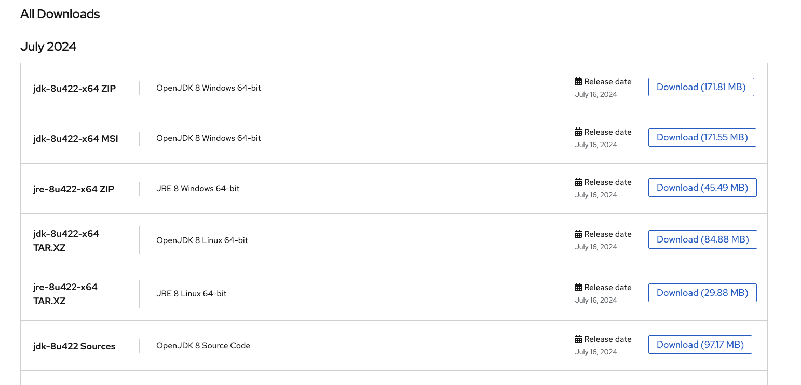

# Setting up Java

In order for you to be able to code/run/debug java apps you need to have a JDK installed on your machine.
Go [here](https://developers.redhat.com/products/openjdk/download), scroll down a little bit and grab OpenJDK 8 for your
OS (might require you to log in).

Click through the installer, open terminal(cmd on Windows) and run:

`java --version`

In case you've done everything correctly some information on the java version should be printed in the console.
