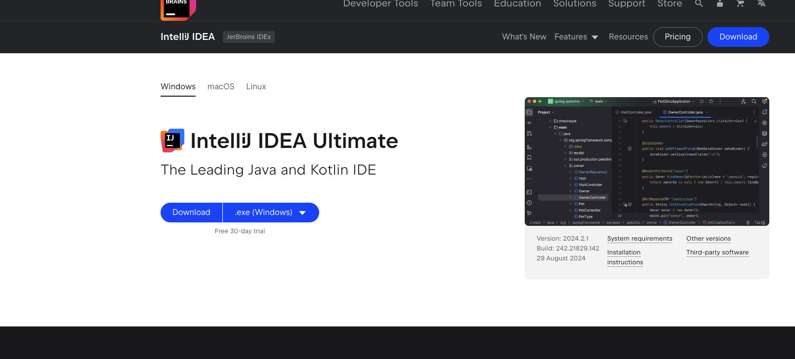

# Setup IDE

IDE - integrated development environment. Basically a program for softboys like me who can't code the whole OS using 
terminal only :skull:. We're going to be using Intellij IDEA. Go [here](https://www.jetbrains.com/idea/download/), choose your
OS and download the installer.

Once again click through the installation process. Run Intellij IDEA and activate 30-day trial. Done! :white_check_mark: