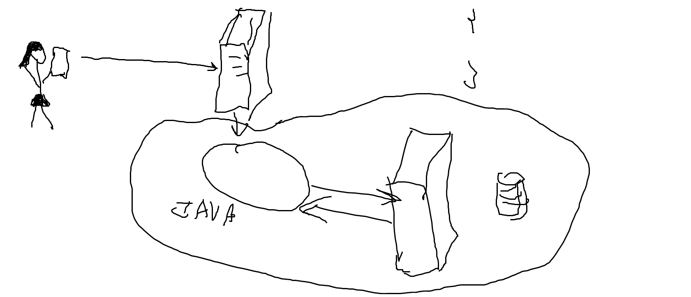
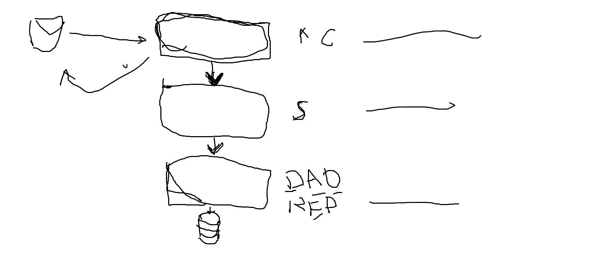

# Introduction To Web Apps
## How it works
Description to be added later

## Three-layered Architecture
###Layers:
1. Controllers Layer (takes in the request, extracts the necessary data,
   passes the data to Services layer)
2. Services Layer (receives the data from Controller layer, validates it,
   executes some logic if needed, uses Data Access layer to read or write
   something from storage(most frequently database))
3. Data Access Layer (mediator for reading from and writing to data storage;
   does not execute any logic)

Each layer knows nothing about the layers above and interacts only with 
the layer directly below it

To read: 
